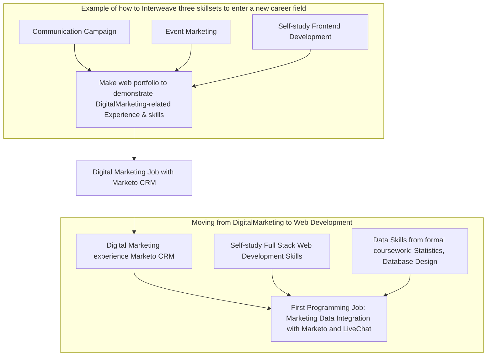

# The Road Code Showed

#### A site & business card for sharing key resources to learn Application Development, User Interface Design, and other IT skills etc.

Live at: https://roadcodeshowed.vercel.app/

>"Programming is the art of telling another human being what you want the computer to do"

For several years I have enjoyed chatting with new learners of programming, and those who are interested in how to begin to learn.

The challenge of teaching a topic to one's self is the need for both Resources (courses, books, forums, chatrooms), and Guidance (a Roadmap to key topics and the order in which to learn them).

This website is simply a digital version of a business card that I pass out, which contains links to the following key learning resources:

**This list is going to appear daunting-- because it is.**  Nothing good comes easy-- good results take time and dedication.  There are no quick fixes in life.

**Remember: This is a marathon, not a sprint.**  Teaching yourself software engineering is a multi-year commitment.

### Getting from Here to There
Despite what I cautioned above about "Quick Fixes",  you can actually see results quickly-- such as a new job, if you begin learning a specific role which has low barriers to entry.  For example, I entered into a Digital Marketing career after learning html, css, and frontend javascript-- which I combined with my Event Marketing (AKA Brand Ambassador) work, and Campaign Management (in my case it was legislative campaign non-profit work) to formulate a strong argument to a hiring manager to hire me.  I had interwoven a skillset of three domains-- First, Campaigning, then Brand Ambassador-ing, and then once I had some tech skills-- I had a solid skillset relevant to Digital Marketing.



The tech-side of things (html, css, basic javascript) at that point only required about 2-3 months of self-study.

## [Roadmap.sh](https://roadmap.sh/)
  - **Roadmap.sh is Role and Skill oriented Roadmap which leads the viewer down a path through learning various technical & IT topics**, for IT Career Roles including:
    - Clientside & Serverside web application design & development
    - Database design & querying
    - Mobile application design & development
    - Cyber Security
    - User Experience Design
    - Alongside this, is a Skill-oriented roadmap for the specific skills involved in the above roles, which break down each skill into a corpus of individual methodologies and knowledge areas.

## [CS50](https://www.youtube.com/@cs50/videos)
  - **CS50** is a series of Computer Science lectures produced by Harvard, on an array of topics, including Programming Languages & Frameworks, General concepts such as Cybersecurity, Ethics, etc.
  - You'll also find multipart videoseries on specific topics-- such as:
    - [CyberSecurity](https://www.youtube.com/watch?v=kUovJpWqEMk&ab_channel=CS50)
    - [Database Design + SQL](https://www.youtube.com/watch?v=wdzA1Z8tKek&ab_channel=CS50)
  
### [IRC](https://en.wikipedia.org/wiki/Internet_Relay_Chat) and other Chatrooms, such as [Discord](https://www.codemonk.ai/insights/top-discord-servers-developers), and [Slack](https://techbeacon.com/app-dev-testing/46-slack-groups-developers)
  - IRC stands for Internet Relay Chat.  Personally, I mostly stick to IRC, however occasionally I visit Discord developer-related chatrooms (mostly because some programming frameworks communities are on Discord but not IRC, such as [the open source "Strapi" CMS](https://strapi.io/blog/migrating-our-community-chat-from-slack-to-discord), or the [Discord-based developer community for Twitch.tv, where devs chat about Twitch.tv API, extensions, plugins, etc.](https://dev.twitch.tv/support/)).
  - It's an old school style, minimalist UI chatroom populated by adept, veteran programmers as well as newbies.
  - The reason it's extremely valuable is because:
    - It allows programmers & learners to engage in free question and answer sessions.
    - It provides real time feedback from another human who often has much more experience in a topic than you, who can provide valuable guidance and insight.
  - If you're new to IRC it can be a little tricky to get started:
    - You'll need to download an app ("software client") for your Operating System (whether Windows, Linux, MacOS).  I use a Mac and I use LimeChat as my IRC client.
    - You'll then need to [register](https://help.ubuntu.com/community/InternetRelayChat/Registration#:~:text=Type%20%C2%AB%20%2Fmsg%20nickserv%20register%20password_of_your_choice,copy%20and%20paste%20into%20IRC.) & login.
    - You'll then need to pick a particular IRC Server-- I recommend [LiberaChat](https://libera.chat/guides/connect)
    - And finally, you can now access IRC Chat Channels, such as [#nodeJS (which run by the NodeJS community)](https://nodejs.org/en/about/get-involved), #javascript, #python, #postgresql #linux, #docker, #security, etc.
  - Without help from the wonderful people who provide free advice and guidance on IRC, I would be lost, confused, and would not be where I am today with regards to my skillset and knowledge.

### [LibraryGensis LibGen.is](https://libgen.is/)
  - **LibGen is library of free eBooks on a range of topics**, including engineering, IT, science, history, economics, etc.  It has a wealth of books on Programming languages & frameworks, & Computer science topics

### [Udemy.com](https://udemy.com/)
  - **Udemy is my favorite source on well organized, professional-grade video tutorials**.  Tip: After creating your account and purchasing a few courses, you'll no longer receive the introductory discount.  Simply create a new email address, then a new Udemy account, and you'll again presented with discounted prices.  (Just remember to note down all your email accounts associated with Udemy so you don't forget where your courses are, such as in Google Drive...)
  - Other options for video courses include 
Coursera, Skillshare, Udacity, LinkedIn Learning, edX
Pluralsight, Alison, Khan Academy, MasterClass, Codecademy, Lynda, and Academic Earth, among others.
  - For learning DevOps & Infrastructure specifically, my favorite video courses are on [KodeKloud](https://kodekloud.com/), but other great options would be [A Cloud Guru](https://acloudguru.com), and [CBT Nuggets](https://www.cbtnuggets.com)

### Learning Journals & Note-taking
  - **Keeping notes and Journals is essential** to staying organized and teaching yourself.  **My preferred tool is [Google Drive](https://drive.google.com/drive/)** but some folks also really like [Obsidian](https://news.ycombinator.com/item?id=39027154) and others
  - I like to keep Learning Journals, Reference Journals, and Project Journals
    - Learning Journals "LJ" (e.g. "LJ - NextJS", "LJ - Software Architecture", "LJ - Linux/Docker/Nginx")
      - In my Learning Journals, I write the date above every entry.  I jot down notes as I work on Projects and study topics.
    -  Reference Journals "RJ" (e.g. "RJ - NextJS", "RJ - Skill Certificates")
       - In my Reference Journals, I paste URLs to specific learning resources, such as articles, forums discussions, or stackoverflow posts, for future reference.
    - Project Journals "PJ" (e.g. "PJ - Server2A: Linux, Nginx, Dockerized Apps")
      - For specific projects, whether business concepts or programming projects, I often keep a Journal.Problem, Error, Solution journal for specific projects
  - All Topic journals, e.g. "All Dev Journal" or "All Business Journal" These are mostly Reference Journals for noting down specific articles of interest related to general topics.

### Certifications

I've heard mixed messages on the value of Certifications from recruiters.  However, personally, although I currently do not have any, I intend to eventually obtain certifications in Project Management (PMP), AWS (there's a variety of them), and Kubernetes (CKAD, though there are several).

I think Certifications are great because:
- They require you to study
- They bring structure to your studies
- Employers typically appreciate them as signals for truly extant, solid skills, in an employment market where often individuals overstate their true skill levels.
- They result in a tangible confirmation of the skills you have built: industry recognized certifications.

In initially studying for the PMP Certification for example, I have founded the knowledge to be valuable.

Though I have experience as a Technical Project Management, I believe the PMP would help to round-out my knowledge as it would further expose me to project management concepts such as Budgets, Risks, and Legal factors, as well as solidify my knowledge on Agile team management, and allow me to develop a better grasp on the standard terminology and taxonomy used in the  Project Management career space.

```bash
npx create-next-app@latest roadcodeshowed
```

______________
This is a [Next.js](https://nextjs.org/) project bootstrapped with [`create-next-app`](https://github.com/vercel/next.js/tree/canary/packages/create-next-app).

## Getting Started

First, run the development server:

```bash
npm run dev
# or
yarn dev
# or
pnpm dev
# or
bun dev
```

Open [http://localhost:3000](http://localhost:3000) with your browser to see the result.

You can start editing the page by modifying `app/page.js`. The page auto-updates as you edit the file.

This project uses [`next/font`](https://nextjs.org/docs/basic-features/font-optimization) to automatically optimize and load Inter, a custom Google Font.

## Learn More

To learn more about Next.js, take a look at the following resources:

- [Next.js Documentation](https://nextjs.org/docs) - learn about Next.js features and API.
- [Learn Next.js](https://nextjs.org/learn) - an interactive Next.js tutorial.

You can check out [the Next.js GitHub repository](https://github.com/vercel/next.js/) - your feedback and contributions are welcome!

## Deploy on Vercel

The easiest way to deploy your Next.js app is to use the [Vercel Platform](https://vercel.com/new?utm_medium=default-template&filter=next.js&utm_source=create-next-app&utm_campaign=create-next-app-readme) from the creators of Next.js.

Check out our [Next.js deployment documentation](https://nextjs.org/docs/deployment) for more details.
